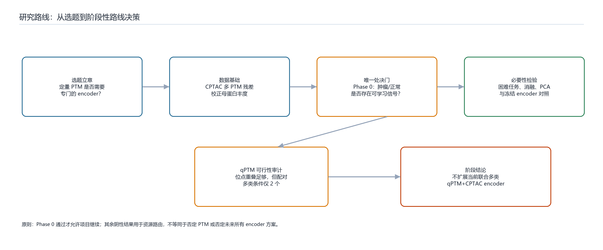
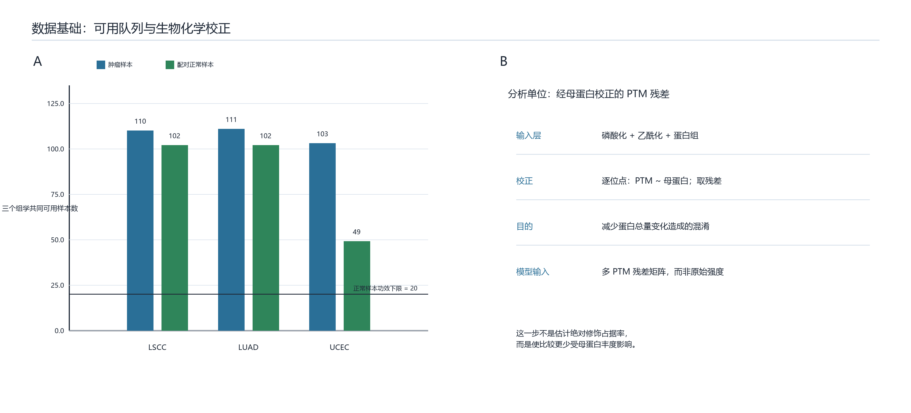
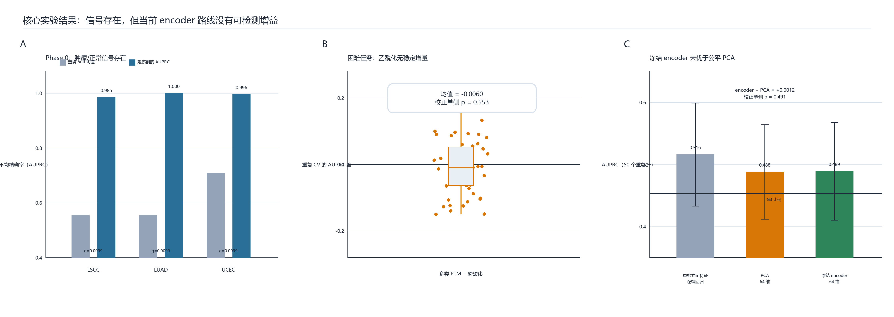
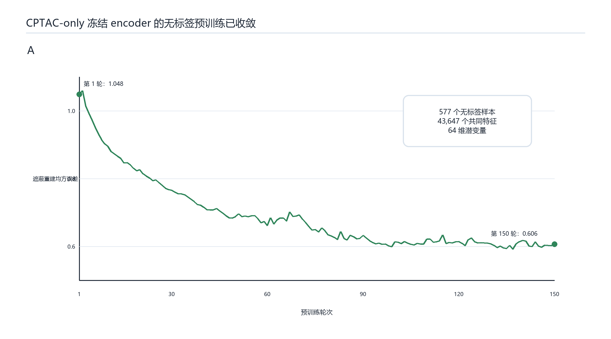
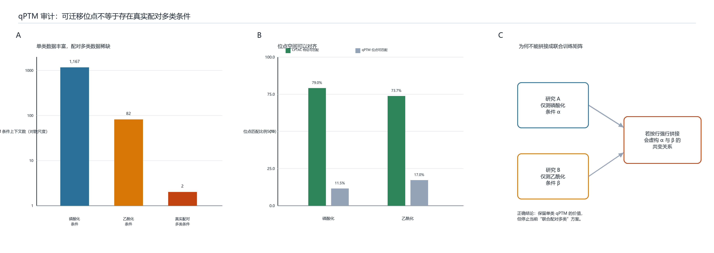
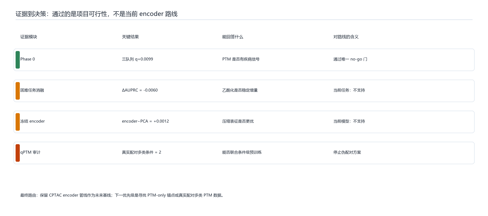

# PTM Encoder 项目阶段汇报：从选题立意到路线决策

> 建议汇报时长：8 分钟。本文是讲稿型 Markdown，可按六张图顺序直接汇报。

## 0. 开场：我们到底在回答什么问题（约 45 秒）

本项目的原始想法是：能否把定量蛋白翻译后修饰（PTM）组织成一个可复用的 encoder 表征，再把这个表征用于患者级疾病预测或其他下游任务？这里的重点不是再做一个“肿瘤和正常分类器”，而是检验 **PTM 的动态状态信息能否形成一种值得单独学习的表示**。

项目一开始就设定了严格边界。encoder 只能在无监督或自监督阶段学习，不允许下游标签反向塑造 encoder；并且全项目只有一个真正的 no-go：如果在经过合理校正的多类 PTM 数据中，连稳定的疾病信号都没有，那么项目的核心前提不成立。其余结果——包括 PCA 或传统模型是否暂时更好——只用于决定资源应该投向哪一条路线，不将其误写为“PTM 无效”。

图 1 概括了本阶段的路线：先建立可比较的数据，再通过 Phase 0 确认信号存在；随后进入更难的 encoder 必要性检验；最后再审计 qPTM 是否足以提供诚实的跨条件、多类 PTM 预训练数据。

## 1. 数据基础：我们没有直接把原始 PTM 强度送入模型（约 1 分钟）

我们选用了 CPTAC 的三个可用队列：肺鳞状细胞癌（LSCC）、肺腺癌（LUAD）和子宫体子宫内膜癌（UCEC）。每个队列都同时具有蛋白组、磷酸化和乙酰化测量，并且共同可用的肿瘤/正常样本数都超过预先设定的正常样本功效下限 20：LSCC 为 110/102、LUAD 为 111/102、UCEC 为 103/49。

关键的数据处理不是简单相减。对于每一个 PTM 位点，我们在样本间回归“PTM 丰度 ~ 该位点母蛋白丰度”，将残差作为后续输入。这样做的目的，是尽量从“某蛋白整体变多或变少”的效应中分离出更接近修饰层变化的部分。它并不声称得到了绝对占据率，但避免了把蛋白总量变化直接误作 PTM 调控。

因此，后续的模型输入是多 PTM 残差矩阵；这也是本项目对“定量 PTM state”最具体的操作化定义。

## 2. Phase 0：先问数据中有没有真实可学习信号（约 1 分钟）

第一道门是队列内肿瘤与正常的预测。我们使用 XGBoost，并通过 100 次标签置换构造经验 null 分布。结果是：LSCC、LUAD、UCEC 的观察到 AUPRC 分别为 0.985、1.000、0.996，三个队列的经验 p 值和 BH 校正 q 值均为 0.0099。

这说明经母蛋白校正后的 PTM 数据包含稳定的疾病相关信号，项目唯一的绝对 no-go 没有触发。尤其 UCEC 是唯一的非肺组织队列，其重复交叉验证均值为 0.994，说明这个结论并不只由两个肺癌队列支撑。

但是，这个结果也产生了一个很重要的研究设计后果：肿瘤/正常任务几乎饱和。既然线性模型和树模型都接近满分，它无法再用来公平判断 encoder 是否比传统表示更好；我们必须主动转向一个更困难的肿瘤内任务。

## 3. 困难任务与多类 PTM 消融：乙酰化有没有稳定增量（约 1 分钟）

我们审计了可用临床标签，并选取 LSCC 肿瘤内 G2 对 G3 分级作为压力测试：106 个肿瘤样本，其中 G2 为 58、G3 为 48。这个任务有临床意义，但不是最终的 PTM-only 生物学锚点；它的作用是制造足够的预测余量，以检查不同表示之间是否存在可重复差异。

我们先比较磷酸化单模态与“磷酸化加乙酰化”多模态。固定五折曾显示多模态多出 0.0476 AUPRC，若只看这一轮很容易得出乐观结论。于是项目继续进行 10 次重复五折，并加入按乙酰化特征块的置换检验。重复 CV 的平均差变为 **-0.0060**，Nadeau–Bengio 校正单侧 p 为 **0.553**；固定折的块置换经验 p 为 0.257。

这不是“乙酰化没有价值”的结论。它的准确含义是：对于当前标签、样本量和模型，乙酰化没有提供稳定、可重复的预测增量；第一次正差不能被当作研究结论。这个步骤保护了项目免于把一次偶然的分折结果包装成方法学优势。

## 4. 冻结 encoder 的必要性检验：它学到了什么，但是否值得继续投入（约 1 分钟 30 秒）

然后我们实现并运行了一个最小但严格的 encoder 对照。它是遮蔽重建的 MLP autoencoder：在 LSCC、LUAD、UCEC 共 577 个无标签 CPTAC 样本上预训练，先对齐共同的多 PTM 特征，再以检测率过滤，最终使用 43,647 个共同特征、256 维隐藏层和 64 维潜变量，训练 150 轮。损失从 1.048 降至 0.606，说明无标签重建目标确实被优化。

但“损失下降”不是 encoder 有下游价值的证据。因此 encoder 完全冻结，G2/G3 标签只用于每个交叉验证折中的逻辑回归头。同时，PCA 也在相同的全部无标签样本上拟合，避免出现“encoder 看过测试样本而 PCA 没看过”的不公平比较。

在 10 次重复五折、共 50 个配对折中，原始共同特征逻辑回归的 AUPRC 为 0.5161，PCA 为 0.4879，冻结 encoder 为 0.4891。encoder 相对 PCA 的平均差仅为 **+0.0012**，校正单侧 p 为 **0.4909**。也就是说，当前 encoder 没有检测到的压缩优势，且没有超过直接使用原始共同特征的线性基线。

这里要谨慎解释 p 值：它表示没有足够证据支持 encoder 优于 PCA，并不等于从数学上证明二者绝对相等；同样，它也不是对所有 Transformer、图模型或序列模型的穷尽性否定。这是对“当前 CPTAC-only、64 维遮蔽重建 encoder 在当前困难任务中是否值得继续大规模投入”的否定性证据。

## 5. qPTM 审计：为什么位点重叠高，仍然不能联合预训练（约 1 分钟 30 秒）

为了判断是否可以用 qPTM 扩展预训练，我们下载、校验、解压并分块审计了公开 qPTM 数据。人类磷酸化共有约 500 万事件、1,167 个实验条件上下文；乙酰化有约 22.8 万事件、82 个条件上下文。与 CPTAC 做保守的“修饰类型 + 基因名 + 位点位置”匹配后，CPTAC 的磷酸化和乙酰化特征分别有 79.0% 和 73.7% 能在 qPTM 位点空间中找到。

表面上看，这似乎足以建立联合预训练。但条件层面的审计揭示了真正的瓶颈：磷酸化与乙酰化真正共享同一 `PMID × Sample × Condition` 上下文的记录只有 **2 个**。不同论文中“只有磷酸化的条件”和“只有乙酰化的条件”不能横向拼成同一行；那会凭空制造两种修饰在同一扰动下共同变化的假象。

因此 qPTM 对单修饰自监督仍然有潜在价值，但它不支持目前设想的“真实配对、多类条件级 qPTM+CPTAC 联合 encoder”。这是一条数据结构上的限制，不是靠增加训练轮次或更换网络结构就能解决的问题。

## 6. 结论、限制与下一步（约 1 分钟）

本阶段的结论需要分两层说。

第一层，项目可行性通过：三队列的 Phase 0 明确表明，多 PTM 残差中存在可学习的疾病信号，项目不应被终止。

第二层，当前路线不值得扩张：困难任务中多类 PTM 没有稳定增量；冻结 encoder 没有优于公平 PCA；qPTM 又缺少真实配对的多类条件。三条证据共同支持停止继续投入 **“qPTM+CPTAC 联合、配对多类条件 encoder”** 的大规模实现与训练。

这个结论有清晰的限制：当前 CPTAC 多类 PTM 只覆盖肺与子宫两种组织；G2/G3 不是最终的 PTM-only 应用锚点；本轮只测试了一个小型 MLP encoder；qPTM 与 CPTAC 的计量尺度不同；尚无外部临床验证或因果验证。因此，我们不能声称“泛癌 PTM encoder 无效”。

下一步应当是：保留现有的 CPTAC encoder 管线和严格评估框架，优先寻找真正由 PTM 状态驱动、而不是主要由形态学或转录程序驱动的任务，例如酶活性、药物反应或可验证的机制锚点；或者等待/获得真实配对的多类 PTM 条件数据后，再重新运行 encoder 与 PCA 的公平对照。

## 讲述时的最终一句话

**我们证明了 PTM 数据本身有稳定疾病信号；但以现有数据结构和当前困难任务衡量，联合多类 qPTM+CPTAC encoder 还没有显示出值得继续扩大投入的独特价值。**

## 产物与可复现性

- 本汇报的正式数值来自 `outputs/` 中的 Phase 0、困难任务、encoder 和 qPTM 审计 CSV。
- 六张图片由 `scripts/generate_stage_report_figures.py` 直接读取这些 CSV 生成。
- 更完整的统计解释、数据集词典与限制，请见 `reference/markdown/ENCODER_NECESSITY_REPORT.md`。
